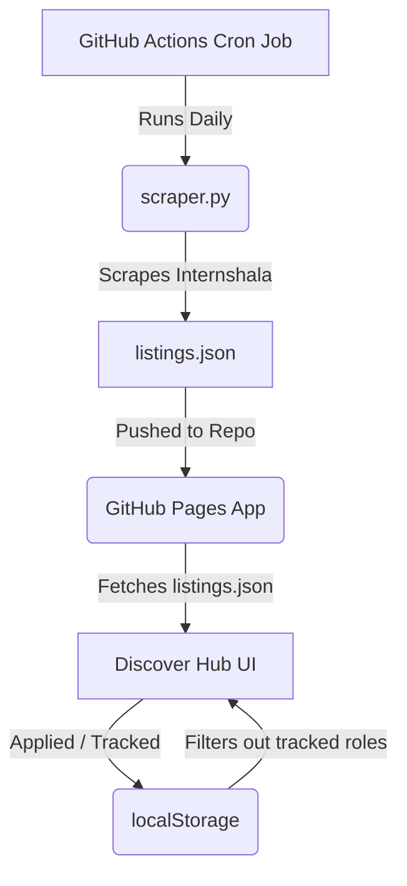

# InternQuest 🚀
### Tactile 3D Sophomore & Undergraduate Internship Hub

**InternQuest** is a lightweight, responsive, and privacy-first single-page application designed for 2nd-year (sophomore) and undergraduate college students in India looking for tailored technical internships. 

It features a playful, tactile **3D claymorphic UI** (complete with micro-animations, custom cards, and drag-and-drop boards) combined with an automated daily web scraper that collects real-time opportunities from the web.

---

## ✨ Features

*   **🎨 Tactile 3D UI:** Custom claymorphic buttons, inputs, and cards built purely with CSS. Interacting with elements gives a tangible "pressed" feedback.
*   **🇮🇳 Regional & Remote Focus:** Specifically tailored for Indian internship seekers, featuring Rupee (`₹`) stipend details and support for major tech hubs (Bangalore, Mumbai/Thane, Pune, Delhi/NCR, Kolkata, Hyderabad) as well as **Work from Home (WFH)** roles.
*   **🎓 Sophomore-Friendly Vetting:** Built-in heuristics scan degree requisites, anti-senior terms, and title keywords to bubble up programs optimized for 2nd-year students (e.g., Google STEP, Microsoft Explore, standard undergrad co-ops).
*   **🔒 Privacy First (Zero DB Backend):** All tracked applications and notes are synced directly to your browser's `localStorage`. No data ever leaves your device.
*   **📋 Kanban Tracker Board:** Drag and drop your tracked internships across columns: **Applied**, **Interviewing**, **Offers**, and **Rejected**.
*   **🎉 Interactive Celebrations:** Drop a card into the **Offers** column or select "Offer" in details to launch an custom HTML5 canvas confetti explosion!
*   **⚡ Auto-Tracking Redirection:** Clicking **Apply Now** opens the application portal in a new tab and triggers a prompt to automatically add the role to your tracker board.
*   **🔄 Daily Automated Scrape:** A GitHub Action runs a Python scraper every day to pull fresh postings and push them to the public catalog.

---

## 🛠️ Tech Stack

*   **Frontend:** HTML5, Vanilla JavaScript, Vanilla CSS3 (3D styles, CSS variables, drag-and-drop API).
*   **Scraper:** Python 3, `BeautifulSoup4`, `Requests`.
*   **Automation:** GitHub Actions (Scheduled Daily Cron Workflow).
*   **Hosting:** GitHub Pages (Serverless & client-side).

---

## ⚙️ How It Works



### 1. The Scraper (`scraper.py`)
Queries regional computer science, python, web development, and WFH channels. It filters listings for unique entries, extracts company details, stipends, durations, and skills, then outputs them into `listings.json`.

### 2. The Filter Pipeline
The client-side JS automatically compares the listings in `listings.json` with the user's `localStorage` tracking board. **Any internship that has been tracked/applied is automatically hidden from the Discover Hub** to keep the search feed fresh.

---

## 🚀 Local Development

### 1. Run the App
To view the web app locally, run a lightweight HTTP server in the project directory:
```bash
python -m http.server 8000
```
Then, open your browser and go to `http://localhost:8000`.

### 2. Run the Scraper Locally
To fetch the latest jobs manually and update `listings.json`:
```bash
# Install dependencies
pip install requests beautifulsoup4

# Run scraper
python scraper.py
```

---

## 🌐 Deploy to GitHub Pages

1. **Initialize Git & Push:**
   ```bash
   git init
   git add .
   git commit -m "Initial commit"
   git branch -M main
   git remote add origin https://github.com/YOUR_USERNAME/YOUR_REPO_NAME.git
   git push -u origin main
   ```
2. **Enable Pages:** Go to your repo's **Settings** -> **Pages** -> Select the `main` branch, `/ (root)` folder -> click **Save**.
3. **Enable Actions Write Access:** Go to **Settings** -> **Actions** -> **General** -> scroll to **Workflow permissions** -> Select **Read and write permissions** -> click **Save** (so the scraper can update listings).

---

## 📝 License

This project is open-source and available under the [MIT License](LICENSE). Feel free to clone, customize, and deploy your own tracker!
